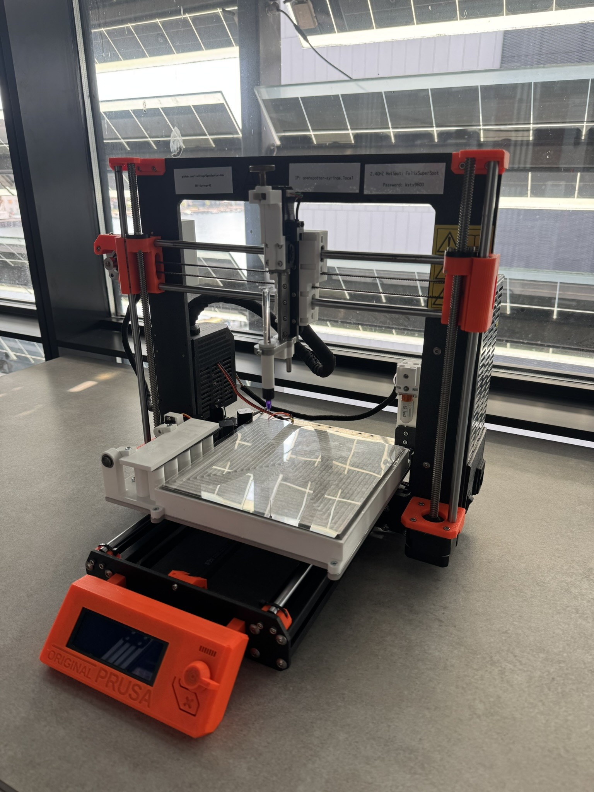
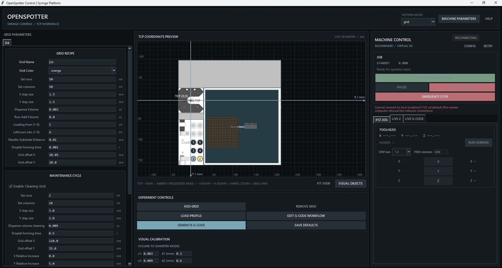

# OpenSpotter-Syringe

OpenSpotter-Syringe is an open-source, syringe-driven liquid-handling and spotting platform. It combines a Python/Tkinter experiment editor, reproducible G-code generation, Klipper configuration for an Einsy RAMBo 1.1a, and two generations of mechanical design files.

SyringeSpotterV2 Hardware

GCODE creation GUI with Realtime Controls

# DEV NOTE
  The current capabilities (V2) are not 100% tested and a full test has not been run yet! The Spotter is not operational prior to software updates. The current version stops prior to bed meshing because of safety interlocks. This could be bypassed, but needs a proper check with test syringe (not glass !!!) before allowing moves. 

  The TCP finds the relative z position of the needle tip and the 3D-Touch creates a bed mesh to account for bed variations, but the offset between TCP-X-BEAM (trigger) and surface has not been measured yet. This will be a absolut offset that applies to all needles, even if mounted at different heights, but has to be manually checked once. RUN TCP calibration, RUN bed mesh, move needle to needle offset, move down to substrate (final accuracy z 20 micron), note offset. 

  Spiral mode is experimental and GCODE creation has not been veryfied. NOT operational!

## Current capabilities

- Configure multiple droplet grids, cleaning and washing cycles, final rinses, and spiral paths.
- Preview geometry in millimetres around the CAPTRON TCP beam crossing at X0/Y0.
- Edit Start, Loading, Printing, Cleaning, and End G-code event blocks at runtime.
- Save versioned JSON profiles beside generated G-code and load those profiles back into the application.
- Connect directly to Moonraker for exact virtual-SD upload/start, monitored Pause/Resume/Cancel, independent Emergency Stop, guarded XYZ motion, and live needle Z trim.
- Calibrate a needle TCP with the retained Klipper optical-cross module.
- Apply saved TCP offsets, bed mesh compensation, and a live needle-to-surface Z trim.
- Use a neutral graphite scientific UI defined centrally in `app/ui_theme.py`.

## Start here

- [GETTING_STARTED.md](GETTING_STARTED.md): install, validate, generate a job, and prepare hardware.
- [Spotter-Control_v3/README.md](Spotter-Control_v3/README.md): application behavior and profile contract.
- [Spotter-Control_v3/ARCHITECTURE.md](Spotter-Control_v3/ARCHITECTURE.md): deployable core/plugin architecture and dependency boundaries.
- [Spotter-Control_v3/PLUGIN_DEVELOPMENT.md](Spotter-Control_v3/PLUGIN_DEVELOPMENT.md): external pattern plugin contract and examples.
- [Spotter-Control_v3/DEPLOYMENT.md](Spotter-Control_v3/DEPLOYMENT.md): wheel, standalone, and writable-data deployment.
- [Spotter-Control_v3/hardware/klipper/README.md](Spotter-Control_v3/hardware/klipper/README.md): configuration, commissioning, TCP calibration, and movement safety.
- [CAD/README.md](CAD/README.md): mechanical-file inventory and manufacturing cautions.
- [Docs/README.md](Docs/README.md): BOM, schematics, datasheets, calibration references, and photos.
- [DOCS_INDEX.md](DOCS_INDEX.md): complete documentation map.

Generated files default to `Spotter-Control_v3/output/gcodes`. That directory is intentionally ignored except for `.gitkeep`; it contains runtime output, not maintained examples.

## Repository layout

- `Spotter-Control_v3/app/core`: reusable plugin, schema, storage, canvas,
  workflow, and shared G-code services.
- `Spotter-Control_v3/app/plugins`: built-in grid and spiral pattern packages;
  installed patterns use the documented entry-point contract.
- `Spotter-Control_v3/app`: generic desktop shell, compiled workflow renderer,
  direct-run artifacts, and Moonraker runtime/controller.
- `Spotter-Control_v3/config`: editable JSON defaults, workflow, visual layout, and UI state.
- `Spotter-Control_v3/hardware/klipper`: active Klipper configuration and custom TCP module.
- `Spotter-Control_v3/tests`: standard-library unit and integration tests.
- `CAD`: native design files and manufacturing exports.
- `Docs`: component and calibration references.

## Project status

Software generation and fake-Moonraker control paths have unit/integration coverage. Physical commissioning, hardware-in-the-loop validation, and experiment-specific risk assessment remain operator responsibilities. Computer vision, automatic lid handling, and a JetValve controller are not implemented in this repository.

Related publication: [ACS Sensors, DOI 10.1021/acssensors.5c02007](https://pubs.acs.org/doi/10.1021/acssensors.5c02007).
