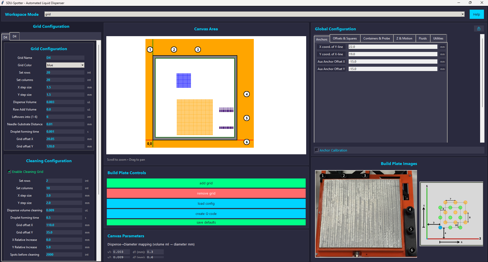
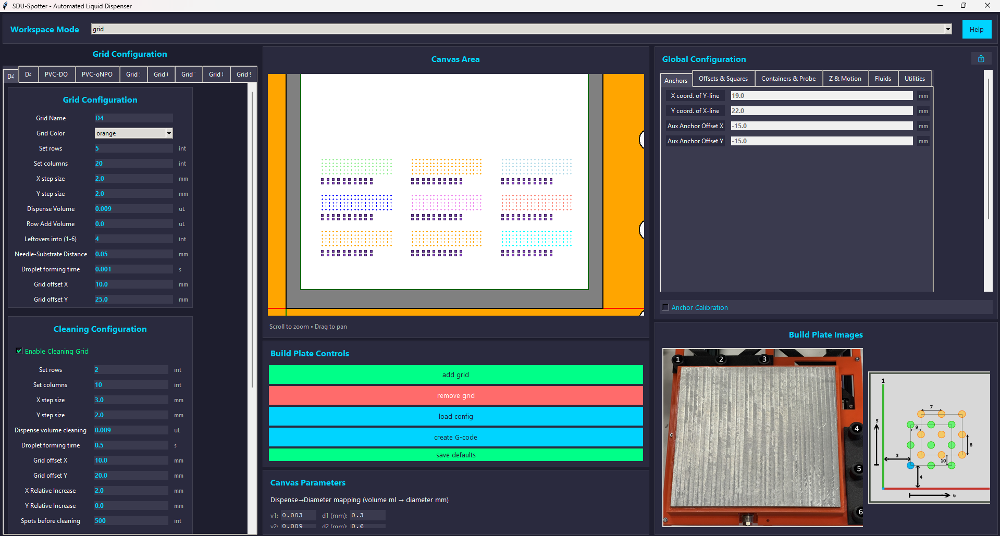
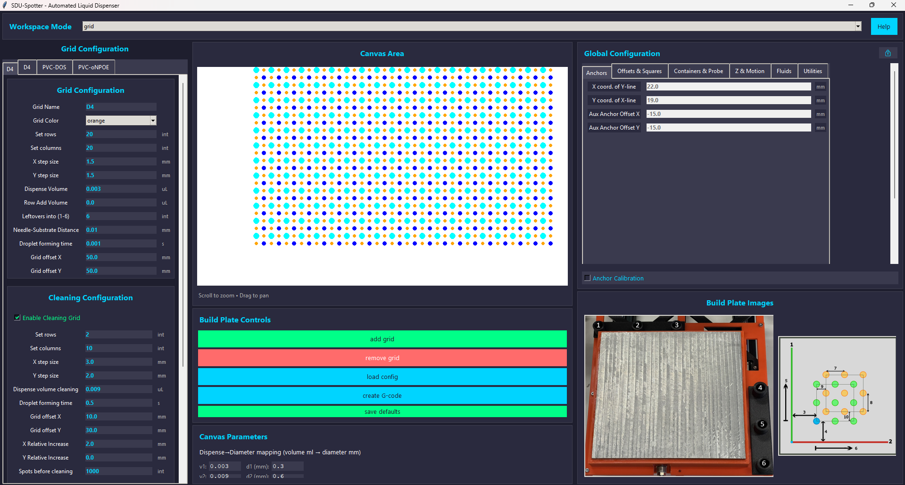

# OpenSpotter-Syringe

OpenSpotter-Syringe is an open source syringe-based liquid handling and spotting platform.
The repository contains the desktop control GUI, G-code generation logic, Klipper configuration examples, and CAD assets for the syringe spotter.

## Examples

1. OpenSpotter-Syringe hardware


2. Main control GUI



3. Separate multi-grid layout



4. Multi-parameter grid layout



## Start Here

- [Spotter-Control_v3](Spotter-Control_v3): Python/Tkinter control application and G-code generator.
- [CAD](CAD): mechanical design files and printable parts. (CAD will follow in future updates)
- [Spotter.JPEG](Spotter.JPEG): reference image of the spotter hardware.
- [DOCS_INDEX.md](DOCS_INDEX.md): documentation map.
- [GETTING_STARTED.md](GETTING_STARTED.md): setup and contributor workflow.
- [PROJECT_DESCRIPTION.md](PROJECT_DESCRIPTION.md): project scope and architecture.

## Run The Control App

```bash
cd Spotter-Control_v3
python -m venv .venv
.venv\Scripts\activate
pip install -r requirements.txt
python main.py
```

The app reads defaults from `Spotter-Control_v3/config`, uses assets from `Spotter-Control_v3/assets`, and saves generated G-code through the file dialog, which starts in `Spotter-Control_v3/output/gcodes`.

## Repository Layout

- [Spotter-Control_v3/app](Spotter-Control_v3/app): GUI, input schema, canvas preview, G-code generation, and plugins.
- [Spotter-Control_v3/config](Spotter-Control_v3/config): editable JSON defaults for global, grid, spiral, and UI state.
- [Spotter-Control_v3/assets](Spotter-Control_v3/assets): images and screenshots used by the app and docs.
- [Spotter-Control_v3/hardware](Spotter-Control_v3/hardware): Klipper and syringe hardware configuration files.
- [Spotter-Control_v3/output](Spotter-Control_v3/output): generated or example G-code output.
- [Spotter-Control_v3/logs](Spotter-Control_v3/logs): runtime logs.

## Publications

- [ACS Sensors publication](https://pubs.acs.org/doi/10.1021/acssensors.5c02007)


## Notes

- Spiral mode is not supported yet
## Contribution Rule

When behavior, setup, architecture, or hardware configuration changes, update the matching documentation in the same change.
