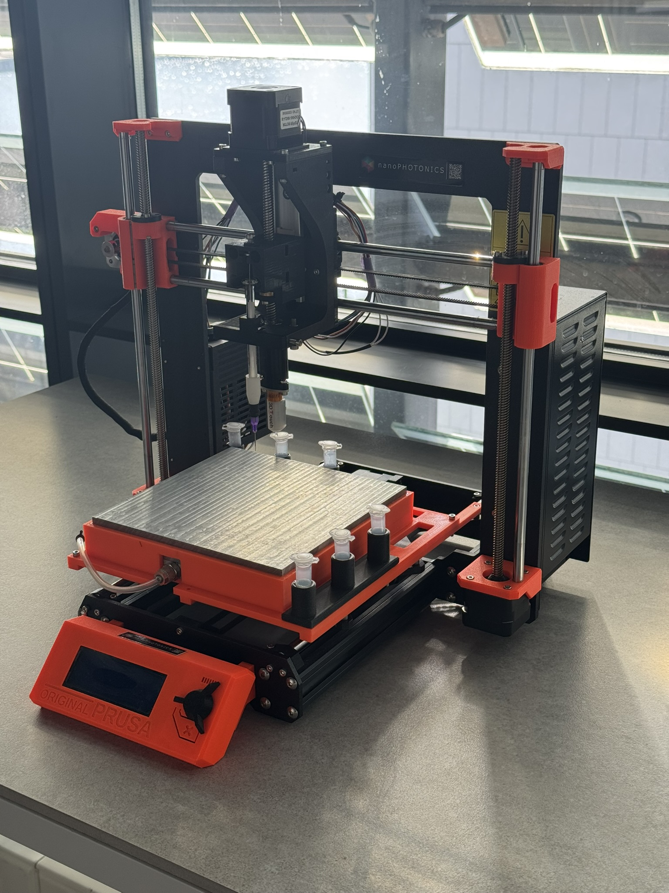

# OpenSpotter Hub

OpenSpotter Hub is an open-source workspace for liquid-handling and spotting platforms. The repository currently contains one implemented platform, OpenSpotter-Syringe, together with its desktop control software, Klipper configuration, mechanical files, and engineering references.

## Platforms

- [OpenSpotter-Syringe](OpenSpotter-Syringe/README.md) is the active syringe-based spotting implementation.
- [OpenSpotter-JetValve](OpenSpotter-JetValve/README.md) is a reserved placeholder; no JetValve implementation is present yet.

## Syringe project map

- [Getting started](OpenSpotter-Syringe/GETTING_STARTED.md)
- [Project scope](OpenSpotter-Syringe/PROJECT_DESCRIPTION.md)
- [Control application](OpenSpotter-Syringe/Spotter-Control_v3/README.md)
- [Klipper configuration](OpenSpotter-Syringe/Spotter-Control_v3/hardware/klipper/README.md)
- [CAD files](OpenSpotter-Syringe/CAD/README.md)
- [Engineering documents](OpenSpotter-Syringe/Docs/README.md)
- [Complete documentation index](OpenSpotter-Syringe/DOCS_INDEX.md)

## Safety and maturity

This is research hardware, not a validated medical or production system. Verify wiring, travel limits, tool state, calibration, generated G-code, and fluid compatibility on the physical machine before enabling motion or dispensing. The included Klipper configuration targets an Einsy RAMBo 1.1a and must be reviewed for the actual build.

The repository is licensed under the [MIT License](LICENSE.txt). Retain any additional file-level notices attached to adapted third-party material.
